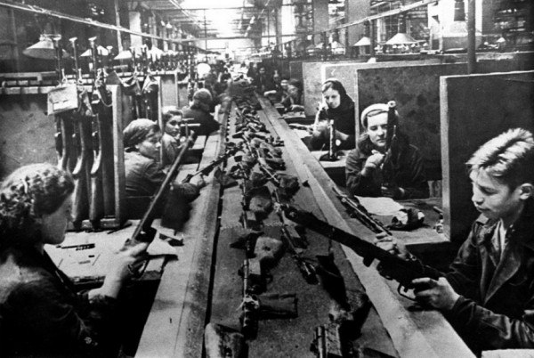

# Блокадный Ленинград –фронту
  
  Накануне войны Ленинград был крупнейшим индустриальным центром страны. В результате вынужденной эвакуации промышленных предприятий мощность оборонных заводов города во втором полугодии 1941 г. уменьшилась примерно на 50 процентов. Вся оставшаяся промышленность , включая местную и промкооперацию, перестроила за короткий срок свою работу на военный лад и переключилась на выполнение заказов фронта.
  

Некоторые исследователи блокады Ленинграда считают, что в осаждённом городе новой боевой техники не выпускалось, а проводился лишь её ремонт. Официальные цифры не подтверждают эту точку зрения. За второе полугодие 1941 г., а ноябрь –декабрь этого года были одними из самых тяжелых месяцев, Ленинград дал фронту 713 танков , свыше 3тыс.полковых и противотанковых орудий , более 10300 минометов , 480 бронемашин , 58 бронепоездов. [1][/#1] Кроме того , за июль –декабрь 1941 г. фронт получил более 3 млн. снарядов и мин, 40 тыс. реактивных снарядов, большее количество другой боевой техники. Много это или мало? В этом отношении показательны следующие сравнительные данные: во втором полугодии 1941 г. в Ленинграде было выпущено 10,1 проц. из всех артиллерийских орудий, изготовленных в стране, 23,5 проц. миномётов и 14,8 проц. танков. Приблизительно 52 проц. мин и 68 проц. снарядов, израсходованных фронтом в тот период, было произведено в Ленинграде. [2](/#2)

Выпускаемые в городе артиллерийские орудия, миномёты и боеприпасы направлялись не только на Ленинградский фронт, но и под Москву. В самый разгар битвы за столицу из осаждённого Ленинграда было отправлено свыше 400 полковых пушек, около 1 тыс. миномётов различных калибров и почти 40 тыс. бронебойных снарядов. 28 ноября 1941 г. командующий Западным фронтом Г.К.Жуков прислал в Ленинград телеграмму: “Спасибо ленинградцам за помощь москвичам в борьбе с кровожадными гитлеровцами”. [3][/#3]

# Примечания

1. История ордена Ленина Ленинградского военного округа. М., 1971.С. 281; Карасёв А.В. Ленинградцы в годы блокады. М.; 1959. С. 122.

2. Ленинградская эпопея. СПб.; 1995. С. 158; Фролов М.И. Артиллеристы в боях за город Ленина 1941-1944. Лениздат, 1978. С. 87.

3. Цит. по: Ленинград в борьбе месяц за месяцем 1941-1944. СПб.;1994. С. 61.

4. Ленинград в осаде. Сб. документов о героической обороне Ленинграда в годы Великой Отечественной войны. СПб.; 1995. С. 182.

5. Очерки истории Ленинградской организации КПСС. Ч.2. Л.;1968. С.624.

6. История ордена Ленина Ленинградского военного округа. С. 283.

7. Ленинград в осаде. С. 167-168.

8. Дзенискевич А.Р. Фронт у заводских стен. Малоизученные проблемы обороны Ленинграда 1941-1944. СПб.;1998. С. 169, 178.

9. Карасёв А.В. Указ. соч. С. 234.

10. Ленинград в осаде. С. 181-182.

11. Дзенискевич А.Р. Указ. соч. С. 229-230.
