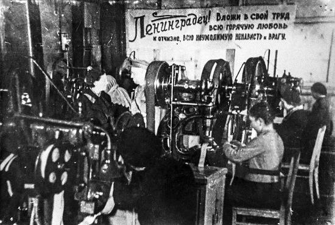
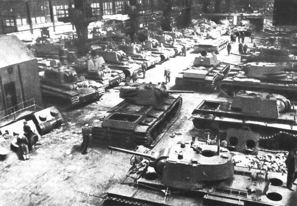

# Блокадный Ленинград –фронту
  
  Накануне войны Ленинград был крупнейшим индустриальным центром страны. В результате вынужденной эвакуации промышленных предприятий мощность оборонных заводов города во втором полугодии 1941 г. уменьшилась примерно на 50 процентов. Вся оставшаяся промышленность , включая местную и промкооперацию, перестроила за короткий срок свою работу на военный лад и переключилась на выполнение заказов фронта.
  

Некоторые исследователи блокады Ленинграда считают, что в осаждённом городе новой боевой техники не выпускалось, а проводился лишь её ремонт. Официальные цифры не подтверждают эту точку зрения. За второе полугодие 1941 г., а ноябрь –декабрь этого года были одними из самых тяжелых месяцев, Ленинград дал фронту 713 танков , свыше 3тыс.полковых и противотанковых орудий , более 10300 минометов , 480 бронемашин , 58 бронепоездов.1 Кроме того , за июль –декабрь 1941 г. фронт получил более 3 млн. снарядов и мин, 40 тыс. реактивных снарядов, большее количество другой боевой техники. Много это или мало? В этом отношении показательны следующие сравнительные данные: во втором полугодии 1941 г. в Ленинграде было выпущено 10,1 проц. из всех артиллерийских орудий, изготовленных в стране, 23,5 проц. миномётов и 14,8 проц. танков. Приблизительно 52 проц. мин и 68 проц. снарядов, израсходованных фронтом в тот период, было произведено в Ленинграде. [2](/#2)

# Примечания

Ленинградская эпопея. СПб.; 1995. С. 158; Фролов М.И. Артиллеристы в боях за город Ленина 1941-1944. Лениздат, 1978. С. 87.

